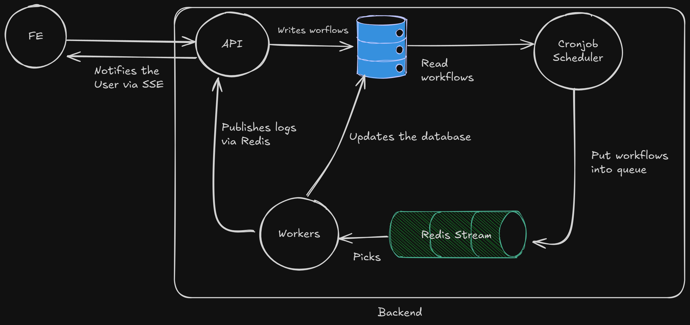

# Workflow Execution Platform

## Overview

The **Workflow Execution Platform** is a system designed to automate complex processes by orchestrating tasks, agents, and triggers within unified workflows. Rather than manually executing operations or developing custom scripts for each process, users can design workflows visually, configure execution parameters, and allow the system to handle automation autonomously.

This platform is designed for teams and developers seeking to:
- Automate repetitive operational tasks
- Orchestrate AI agents or APIs in logical sequences
- Execute workflows based on schedules or real-time events
- Maintain system reliability as operations scale in complexity

The platform serves as a centralized automation control center capable of managing both simple and sophisticated use cases with minimal manual intervention.

---

## Core Benefits

### Scheduled Automation
Configure workflows to execute at precise times or regular intervals. Eliminates manual execution requirements and prevents missed runs. Ideal for report generation, data synchronization, and agent orchestration.

### Multi-Agent Orchestration
Each agent performs specialized functions including data retrieval, text generation, and decision processing. Agents can be connected to operate sequentially or in parallel, transforming isolated tools into integrated automation systems.

### Conditional and Parallel Execution
Supports branching logic and multi-path execution patterns. Workflows can evaluate conditions and automatically route execution through appropriate branches based on runtime criteria.

### Horizontal Scalability
Built on event-driven and queue-based architecture, enabling independent execution of hundreds of concurrent workflows. Resource-intensive tasks are automatically distributed to background workers, ensuring consistent performance characteristics.

### Execution Monitoring
Each workflow generates events throughout its lifecycle:
- `workflow.started`
- `node.completed`
- `workflow.finished`

These events enable real-time tracking, debugging of failures, and performance measurement.

### Fault Tolerance
The system maintains workflow state persistence, allowing recovery after worker or server restarts. This ensures continuity of execution for long-running or business-critical processes.

---

## Use Cases

| Application Domain | Implementation Example |
|-------------------|------------------------|
| **AI Agent Orchestration** | Chain multiple language model agents for collaborative tasks: one generates content, another performs fact-checking, a third produces summaries. |
| **Automated Reporting** | Execute daily workflows that retrieve data, apply formatting, and distribute reports via email. |
| **Data Integration and ETL** | Schedule data extraction from APIs or databases, perform transformations, and load results to destination systems. |
| **Internal Process Automation** | Connect internal APIs and automation tools without developing new backend infrastructure for each integration. |

---

## Operational Model

### 1. Workflow Design
Create workflows using a visual canvas interface with connected agents and logic nodes.

### 2. Trigger Configuration
Define execution parameters including cron schedules, specific timestamps, or manual API invocation.

### 3. Automatic Execution
The system processes each workflow step according to defined dependencies and branching logic.

### 4. Monitoring and Response
Access execution logs, manage error conditions, and integrate events with external systems as required.

---

## Key Characteristics

- **Visual Interface:** Design automation workflows through intuitive graphical representation
- **Flexible Composition:** Combine AI agents, conditional logic, and data operations
- **Versatile Triggering:** Support for time-based scheduling and event-driven execution
- **Intelligent Execution:** Manages parallel and sequential step execution with comprehensive state tracking
- **Extensible Architecture:** New agents and logic components can be integrated as needed

## Technology Stack

- **Frontend:** Next.js , TypeScript, TailwindCSS
- **Backend:** Next.js Route Handlers, Bun runtime
- **Database:** PostgreSQL with Prisma ORM
- **Message Queue:** Redis Streams and Pub/Sub
- **Authentication:** Better-Auth

---

## Architecture

The platform implements a modular, event-driven architecture:

### Workflow Service
Manages workflow definition lifecycle including creation, modification, and persistence. Each workflow consists of nodes (agents) and edges (execution paths).

### Execution Engine
Processes workflows step-by-step with support for branching, parallel execution, and conditional logic. Emits lifecycle events for monitoring and integration purposes.

### Redis Event Bus
Provides message broker functionality for asynchronous communication between components. Manages event publication and task queue operations.

### Background Workers
Process workflow tasks asynchronously with horizontal scaling capabilities for high-concurrency workloads.

